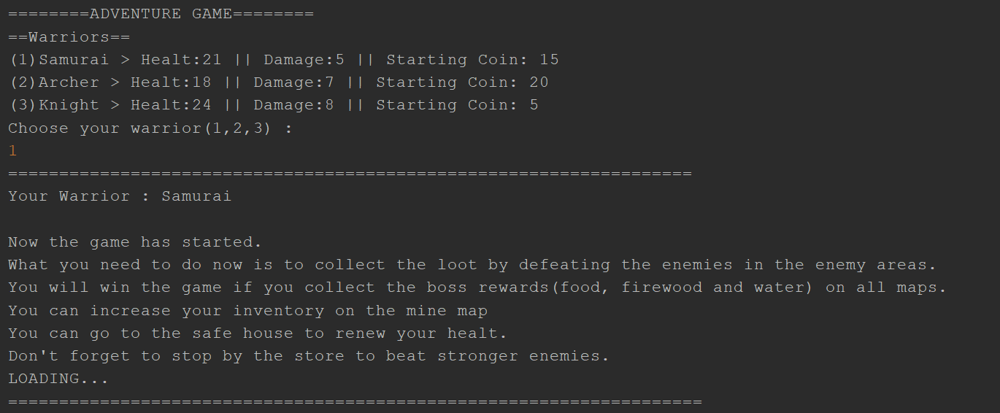
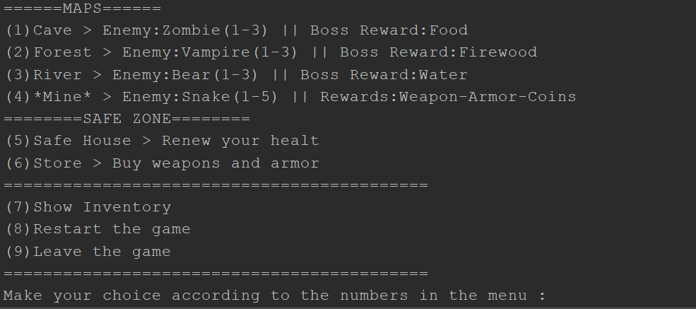
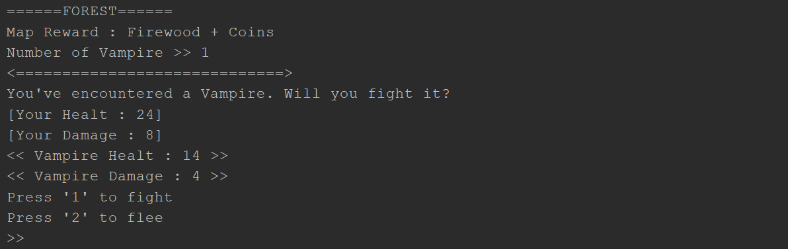
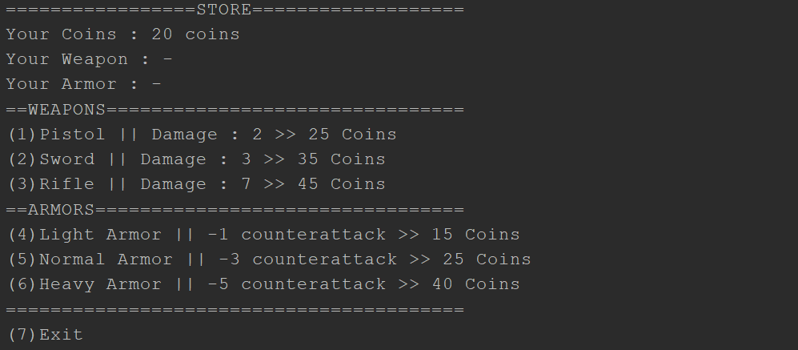

# Adventure Game
Adventure game is text based role playing game by using object oriented programming concepts and design patterns.

## Gameplay
You earn coins and rewards by killing the characters with different abilities and creatures with different powers that you choose in the game. If you can collect the boss prizes on all maps and return to the safe house, you will win the game. You can buy armor or weapons from the store with the coins you collect. You can also collect loot from the creatures you kill by fighting on the bonus map in the game according to different possibilities.

## Screenshots

